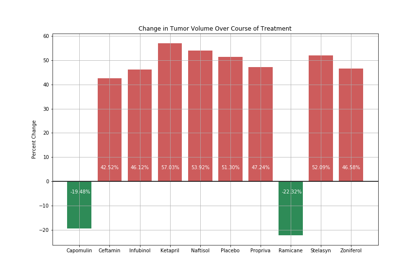
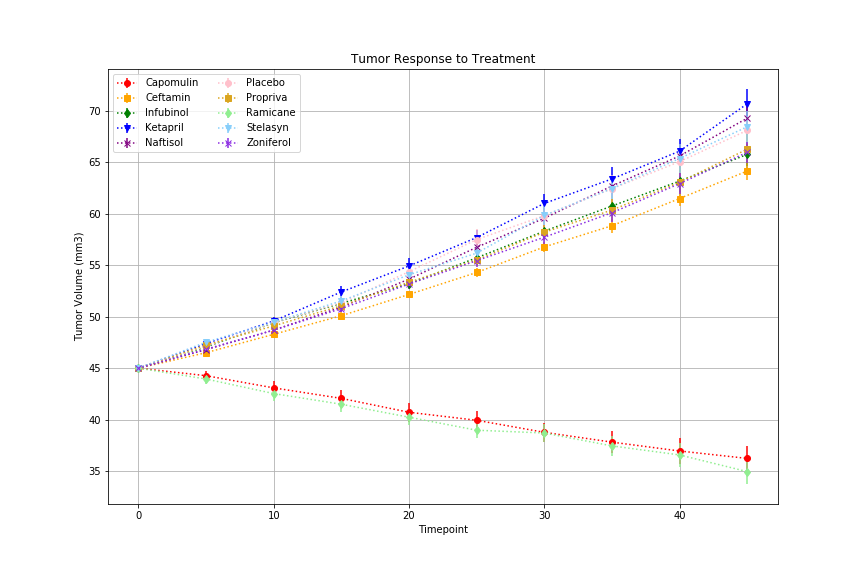
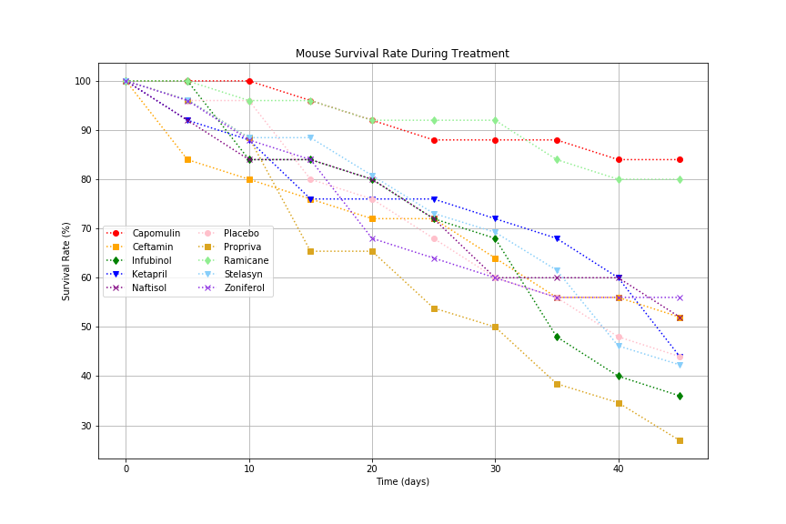

# matplotlib_tumor

Visualizations of experimental cancer treatments in mice using matplotlib



Deployed at: https://jackrapp.github.io/matplotlib_tumor/

## Tumor Growth

Comparing the tumor size over time we can see that the only two effective treatments are Ramicane and Capomulin, as they are the only drugs that showed reduced tumor size at the end of the experiment. All other treatments closely follow the placebo and show tumor growth.



## Survival Rate

Mouse survival correlates with effectiveness of treatment, reducing tumor growth has a direct affect on mouse survival over the 45-day trial.



## Source Data

Data summarized using pandas groupby and pivot tables

```python
# Store the Mean Tumor Volume Data Grouped by Drug and Timepoint
tvol_gb = exp_df.groupby(["Drug","Timepoint"], as_index=False)

# Convert to DataFrame
tvol_df = tvol_gb[["Tumor Volume (mm3)"]].mean()

# Pivot DataFrame for Graphing
tvol_pivot = tvol_df.pivot(index='Timepoint', columns='Drug', values='Tumor Volume (mm3)')

# Preview Pivot Table
tvol_pivot.head()
```

Drug | Capomulin | Ceftamin | Infubinol | Ketapril | Naftisol | Placebo | Propriva
---|--------|-------|--------|--------|--------|--------|--------
0 days | 45.000000 | 45.000000 | 45.000000 | 45.000000 | 45.000000 | 45.000000 | 45.000000
5 days | 44.266086 | 46.503051 | 47.062001 | 47.389175 | 46.796098 | 47.125589 | 47.248967
10 days | 43.084291 | 48.285125 | 49.403909 | 49.582269 | 48.694210 | 49.423329 | 49.101541
15 days | 42.064317 | 50.094055 | 51.296397 | 52.399974 | 50.933018 | 51.359742 | 51.067318
20 days | 40.716325 | 52.157049 | 53.197691 | 54.920935 | 53.644087 | 54.364417 | 53.346737
